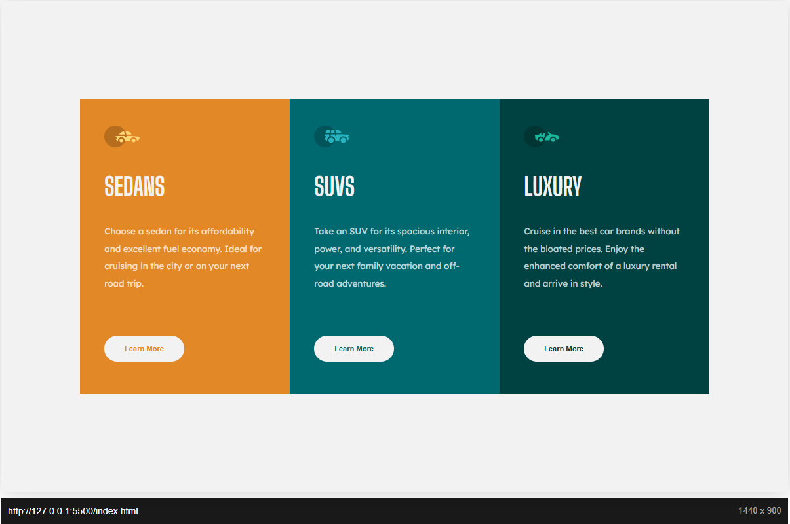
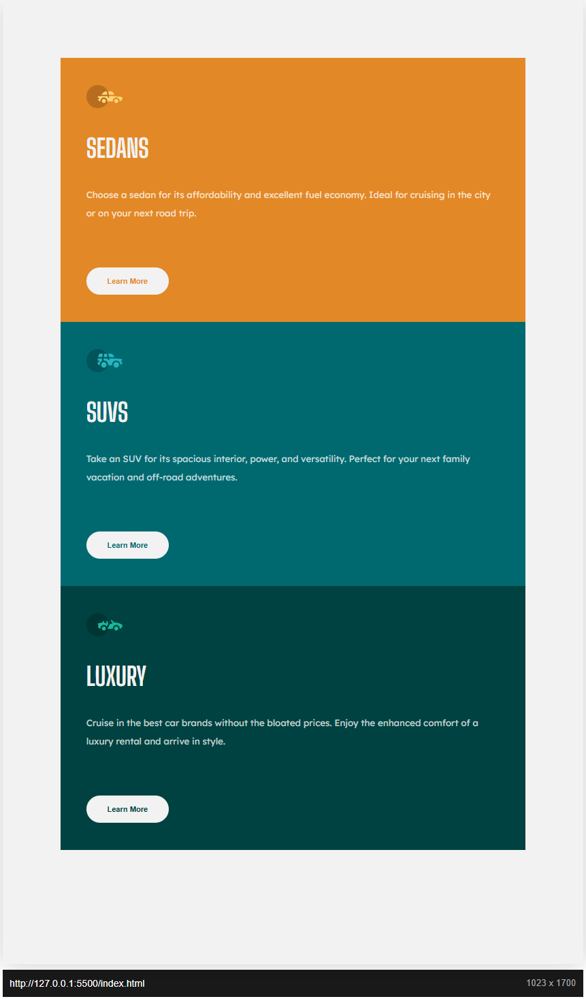
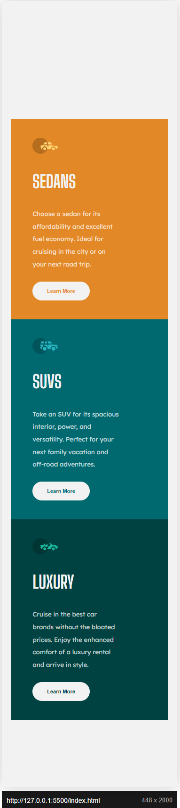

# Frontend Mentor - 3-column preview card component solution

Esta é uma solução para o desafio do [Frontend Mentor](https://www.frontendmentor.io/challenges/3column-preview-card-component-pH92eAR2-). 

## Aprendizado

Através deste desafio oferecido pelo [Frontend Mentor](https://www.frontendmentor.io) pude desenvolver e aplicar conhecimentos sobre responsividade e semântica.

## Screenshots
### Desktop

### Mobile - Tablet

### Mobile - Celular

